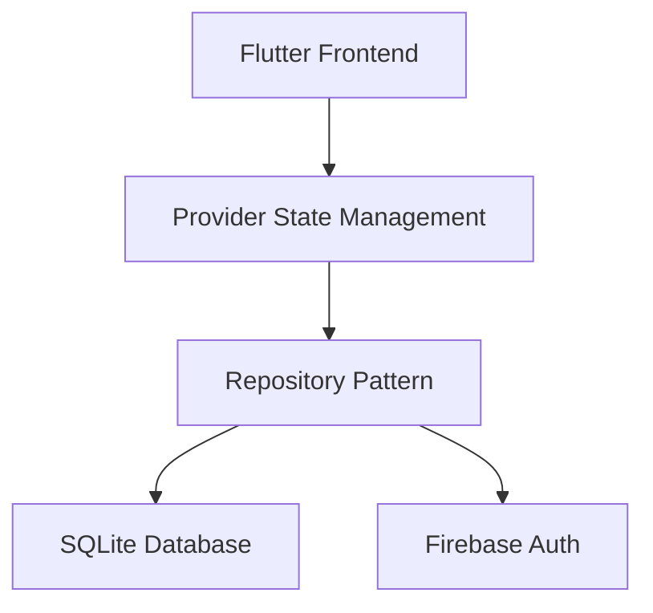

# Enterpro App

Enterpro es un ecosistema educativo gamificado diseñado para transformar la experiencia de aprendizaje en matemáticas, educación financiera e introducción al software. Nuestro objetivo es hacer que el aprendizaje sea atractivo, interactivo y efectivo para estudiantes de todas las edades.

## Características Principales

- **Aprendizaje Gamificado**: Incorpora elementos de juego como puntos, insignias, tablas de clasificación y desafíos para motivar a los usuarios.
- **Contenido Educativo Integral**: Cubre matemáticas, educación financiera básica y fundamentos de programación.
- **Perfiles de Usuario Personalizables**: Permite a los usuarios crear y personalizar sus avatares y perfiles.
- **Seguimiento del Progreso**: Herramientas para monitorear el avance del aprendizaje y las habilidades adquiridas.
- **Accesibilidad**: Diseñado para ser accesible en diversas plataformas.

## Impacto Potencial

Enterpro busca fomentar el interés en las materias STEM (Ciencia, Tecnología, Ingeniería y Matemáticas) desde una edad temprana, equipando a los estudiantes con habilidades esenciales para el futuro y promoviendo la inclusión digital.

## Tecnologías Utilizadas

- **Flutter**: Framework de UI de Google para construir aplicaciones compiladas nativamente para móvil, web y escritorio desde una única base de código.
- **Dart**: Lenguaje de programación optimizado para UI, utilizado por Flutter.
- **C++**: Utilizado para componentes nativos de alto rendimiento en Android y plugins.
- **Swift**: Lenguaje principal para el desarrollo nativo en iOS/macOS.
- **CMake**: Sistema de construcción para configurar proyectos multiplataforma.
- **HTML/CSS/JavaScript**: Tecnologías web utilizadas cuando se compila para la web.
- **Gradle/Kotlin Script**: Para la configuración de builds en Android.
- **Xcode Build System**: Para la configuración de builds en iOS/macOS.

# EnterPro - Sistema de Gamificación

## Descripción del Proyecto

Enterpro es una aplicación educativa gamificada diseñada para que los niños pierdan el miedo a las matemáticas y descubran de forma divertida el mundo de la educación financiera y la programación.

### Objetivo

*   **Romper el miedo a los números**: enseñar matemáticas de manera interactiva, como si fuera un juego.
*   **Educar en finanzas personales**: que los niños aprendan a manejar dinero, ahorro y pequeños presupuestos desde temprana edad.
*   **Introducir al desarrollo de software**: darles sus primeros pasos en programación, desde lo más básico hasta conceptos más avanzados, de forma gradual.

### ¿Qué lo hace diferente?

*   **Gamificación total**: cada avance desbloquea niveles, insignias y recompensas.
*   **Ruta de aprendizaje progresiva**: empieza con conceptos básicos y avanza hasta temas más profesionales.
*   **Herramienta para desarrolladores y educadores**: no es solo para los niños, sino que otros profesionales podrán usar Enterpro para enseñar y acompañar el proceso.

### ¿Para quién es Enterpro?

*   Niños y adolescentes que quieren aprender matemáticas sin miedo.
*   Escuelas y colegios que buscan una forma innovadora de enseñar.
*   Padres que quieren que sus hijos aprendan sobre dinero y tecnología.
*   Desarrolladores y docentes que quieran un recurso listo para usar en clases o talleres.

## 🏗 Arquitectura


## 🚀 Cómo Empezar
### Requisitos
- Flutter 3.0+
- Dart 2.17+
- Android Studio/VSCode

### Instalación
```bash
flutter pub get
flutter run
```

### Pruebas
```bash
flutter test
```

## 🛠 Estructura de Directorios
```
lib/
├── models/       # Modelos de datos
├── repositories/ # Capa Repository
├── providers/    # State Management
├── services/     # Lógica de negocio
└── screens/      # UI
```

## 📚 Documentación Técnica
### Patrones Usados
- Repository Pattern
- Provider (State Management)
- Clean Architecture (Inicial)

### Endpoints API
| Método | Endpoint       | Descripción          |
|--------|----------------|----------------------|
| POST   | /api/login     | Autenticación        |
| GET    | /api/user/{id} | Datos de usuario     |

## 🛡 Manejo de Errores
El sistema implementa:
- Try/Catch en operaciones críticas
- Mensajes de error amigables
- Fallback para conexión offline

## 🤝 Cómo Contribuir
1. Haz fork del proyecto
2. Crea tu branch (`git checkout -b feature/foo-bar`)
3. Haz commit de tus cambios (`git commit -am 'Add some fooBar'`)
4. Push al branch (`git push origin feature/foo-bar`)
5. Abre un Pull Request

## 📄 Licencia
MIT

Para ejecutar el proyecto localmente, sigue estos pasos:

1.  **Requisitos Previos**:
    - Flutter SDK (versión 3.13.0 o superior)
    - Dart SDK (versión 3.1.0 o superior)
    - Android Studio/Xcode (para desarrollo móvil)
    - Visual Studio Code (recomendado) con extensiones Flutter/Dart

2.  **Clonar el repositorio**:
    ```bash
    git clone https://github.com/AlexisCardozzo/enterpro_app.git
    cd enterpro_app
    ```

3.  **Obtener dependencias**:
    ```bash
    flutter pub get
    ```

4.  **Ejecutar la aplicación**:
    ```bash
    flutter run
    ```

5.  **Ejecutar pruebas**:
    ```bash
    flutter test
    ```

## Arquitectura del Proyecto

El proyecto sigue una arquitectura en capas con los siguientes componentes principales:

- **Capa de Presentación**: Contiene widgets y pantallas (lib/screens/)
- **Capa de Lógica**: Providers y controladores (lib/providers/)
- **Capa de Servicios**: Conexión con APIs externas (lib/services/)
- **Capa de Modelos**: Estructuras de datos (lib/models/)

## Guía de Estilo

- **Nomenclatura**:
  - Widgets: PascalCase (Ej: `GameScreen`)
  - Variables: camelCase (Ej: `playerScore`)
  - Constantes: UPPER_CASE (Ej: `MAX_LEVEL`)
- **Documentación**:
  - Documentar todas las funciones públicas con comentarios DartDoc
  - Usar `//` para comentarios de una línea
  - Usar `///` para documentación de API

## Endpoints API

| Endpoint | Método | Descripción |
|----------|--------|-------------|
| /api/users | POST | Crear nuevo usuario |
| /api/games | GET | Obtener lista de juegos |
| /api/progress | PUT | Actualizar progreso del usuario |

## Contribución

¡Agradecemos las contribuciones! Si deseas contribuir, por favor, haz un fork del repositorio y envía un pull request con tus cambios.
